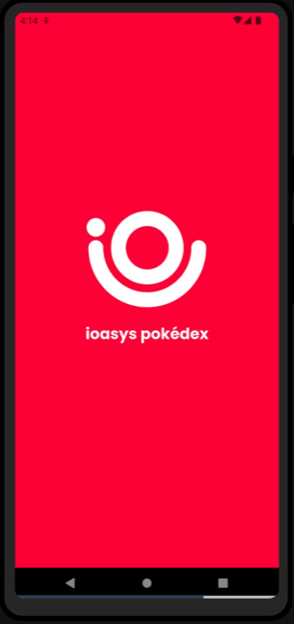
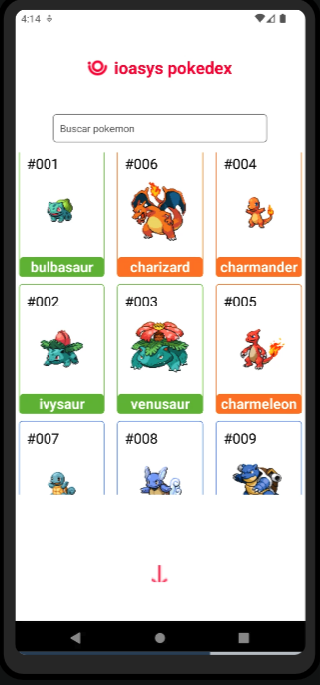
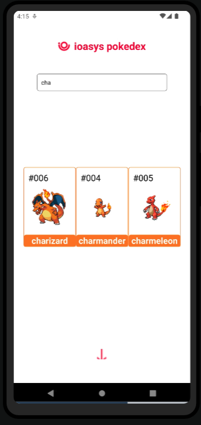
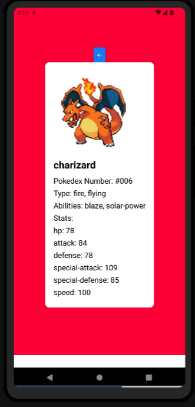

# Desafio PokeDex - ioasys Turma 5

## Projeto
Este projeto foi implementado como desafio da 1ª etapa do ioasys Camp (turma 5). Esse README guiará sobre as informações gerais do que foi desenvolvido por mim.

### Tecnologias 🛠️
- React Native (v50.0.0): Framework para desenvolvimento de aplicativos móveis em `Android`, `iOS`, entre outros.
- PokeAPI: `API RESTful` com informações do universo Pokemón.
- Bibliotecas: Foram utilizadas diversas bibliotecas no projeto, sendo as principais: ‘react-native’ e ‘react’.
- IDE: Inicialmente o código foi desenvolvido na ferramenta Intellij + XCode , no entanto, a mesma vinha apresentando bugs (abordado com o instrutor durante as aulas e mentorias) e falhas que atrasavam a evolução do projeto. Após testes, decidi passar a utilizar a solução Expo.Dev, da qual também estou familiarizado.

### Arquitetura de arquivos 📐 

O aplicativo foi construído utilizando uma arquitetura componentizada conforme estrutura abaixo:
[raíz]
__tests__
assets
images
splash
pokeball
icons
fonts
components

- **CardDetail.js** (componente para visualização de detalhes de pokemon selecionado)
- **CardPage.js** (componente para visualização de lista de pokemons carregados)
- **ErrorPage.js** (componente para exibição de página de erro quando pokemón buscado não for encontrado)
- **FilterPokemon.js** (componente para filtragem de pokemón ao clicar no seu ícone na tela inicial)
- **LoadingPage.js** (componente para carregando do splash, tela de loading inicial)
- **NavigationCardDetail.js** (componente para paginação de pokemóns da tela inicial)
- **SearchBar.js** (componente para resolução de busca por pokemóns)
  
### styles
- **PokeStyles.js** (componente que centraliza os estilos visuais utilizados no aplicativo)
- **CardStyle.js** (componente estático que traz cores esperadas de cada pokemon)
- **App.js** (código da tela inicial, com requisições aos componentes necessários para o funcionamento do aplicativo)

### Telas 🖼️ 
- **Loading** + **Tela inicial**: Tela composta pela lista dos pokemons extraídos da API.
- **Botão de carregamento**: Foi solicitado o desenvolvimento de um botão que apresentasse na tela mais Pokemóns além da lista inicial (com 9 itens). Esse botão foi implementado com funções de paginação que percorre a lista extraída a partir da PokeAPI.

- **Busca**: Uma barra de busca foi implementada para que o usuário pudesse localizar um pokemon específico a partir do seu nome ou ID.

- **Card do pokemón**: Ao clicar em um pokemon especifico, uma nova tela é carregada com as informações detalhadas do pokemon extraídas da API. Um botão de retorno foi adicionado para que o usuário pudesse voltar ao estado inicial do aplicativo.

 

### Rodando o projeto 🚀 

Escrever minimamente como a pessoa pode pegar esse codigo e rodar na maquina dela ou no expo.dev.

### Testes ✅ 

Dois arquivos de testes foram criados para buscar garantir o funcionamento esperado dos componentes `CardPage.js` e `SearchBar.js`, os testes poderiam ser executados utilizando o `Jest` e o `React Native Testing Library`. 

No entanto, como precisei utilizar uma `IDE online`, a execução dos mesmos ainda não foi possível. As imagens dos testes implementados podem ser vistas abaixo:

🧑‍💻 Desenvolvedor
[FOTO SUA + NOME + LINK DO LINKEDIN]
